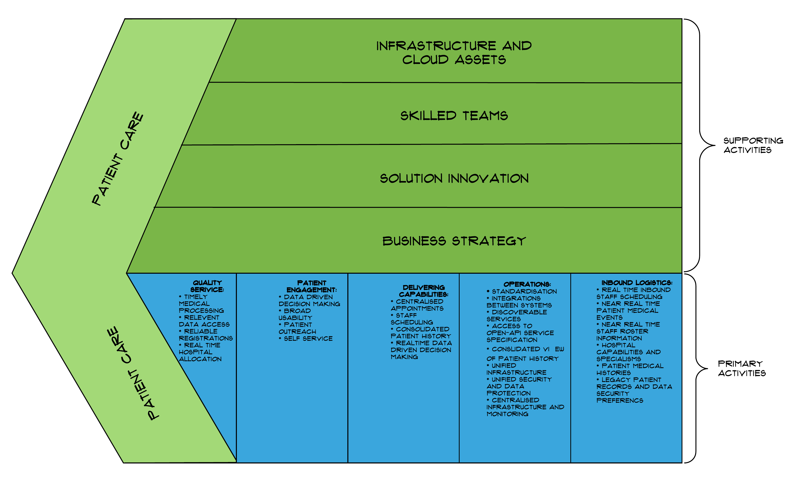
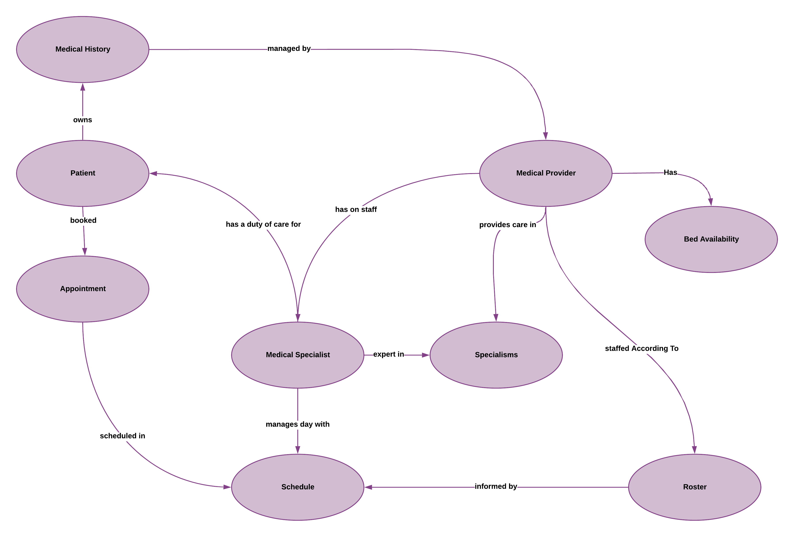
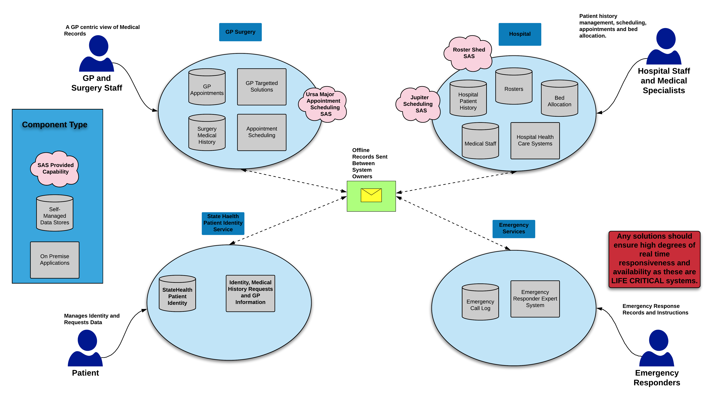
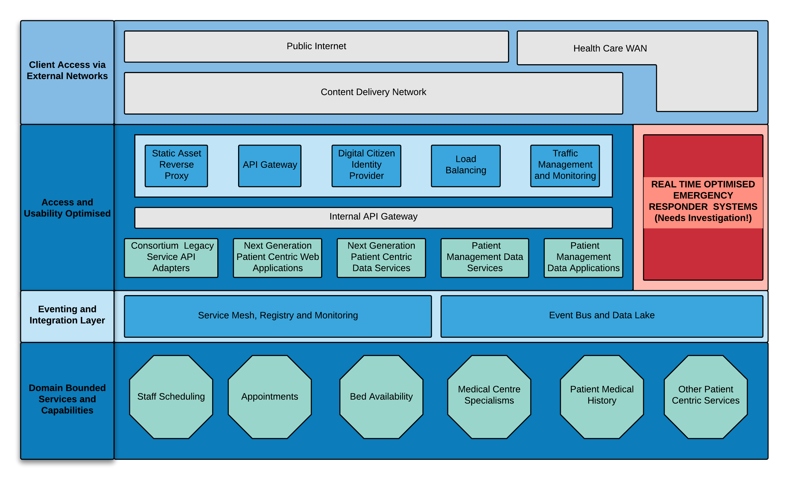

# Architecture Definition Document

# Executive Summary 

This document details the baseline architectures, business proposition, target architecture vision, migration requirements and provides a gap analysis between the two.

# Purpose

The Architecture Definition Document is the deliverable container for the core architectural artefacts created during this project. The Architecture Definition Document spans all architecture domains (business, data, application, and technology) and also examines all relevant states of the architecture (baseline, interim state(s), and target).

The Architecture Definition Document is a companion to the Architecture Requirements Specification (yet to be prepared for this project), with a complementary objective:
* The Architecture Definition Document provides a qualitative view of the solution and aims to communicate the intent of the architects.
* The Architecture Requirements Specification provides a quantitative view of the solution, stating measurable criteria that must be met during the implementation of the architecture.

_It is suggested that this document reference the various deliverables in the container. For instance, the Architecture Principles will be documented in an Architecture Principles document and that document referenced here. It may be that this container is implemented using a wiki or as an intranet rather than a text-based document. Even better would be to use a licensed TOGAF tool that captures this output._

_This template shows “typical” contents of an Architecture Definition Document and can be adapted to align with any TOGAF adaptation being implemented._

# Target Audience
This deliverable is intended to be consumed by all individuals involved in the project. It defines a vision and high-level architecture which address the business drivers of the project.
This document, therefore, should act as an input into further stages of elaboration, with new insights back-propagated as revisions to this document.

# Business Context and Drivers

A consortium of four leading companies have come together to consolidate their efforts, data, applications and roadmaps in order to develop a next-generation patient-centric platform capable of improving base-line patient care, while also being responsive and capable of, real-time, data driven decision making in emergency situations.

The following organisations bring data specialisation and patient centric expertease in each of the following domains.

| *Organisation* | *Specialist Domain* | *Business Motivations* | *Notes* |
| -------------- | ------------------- | ---------------------- | ------- |
| Ursa Major Health | GP Appointment Scheduling | Workflow enhancement around manual integration with other systems | Appointment consolidation and reducing integration issues with hospital appointment systems |
| Jupiter Scheduling | Hospital appointment scheduling | Workflow enhancement around manual integration with other systems | Synergies with other appointment systems and removal of manual integrations with GP scheduling systems |
| Emergency Expert Systems | Real time hospital recommendations based on bed availability | Data integration and quality required to improve decisions | Reduce rate of poor recommendations by weighing decisions based on the patients broader medical history. | 
| Roster Shed | Medical staff rosters and scheduling | Workflow enhancement | Currently depends on unreliable manual updates of appointment systems when staff are not available |   

All parties in the consortium intend to reduce duplication of matching capabilities, whilst developing new capabilities which present opportunies to deliver value to patients through improved integration and data sharing between systems.   

The primary goal of the consolidated project is to evolve a service based platform which benefits from event streams between systems, enabling decoupled and fault-tolerant single responsibility services adhering to the [principles](../architecture-principles/) of a decomposed microsevice architecture.

# Target Business Capability Value Chain

The following diagram depicts a target value chain which is expected to be supported on delivery of the final target state architecture laid out in this document. 

The end goal of delivering value in *patient care* will be 
made possible across the consortium by combining our shared 
strengths to provide a foundation of shared infrastructure supported 
by the combined capability of teams skilled in the patient care business domain. 

This in turn will support innovation around patient centric solutions in line with business
strategy aimed at improving the overall standard of patient care. This foundation is expected 
to support the consortium in providing improved patient care through 
delivery of its primary daily activities, documented above. 

# Scope and Project Goals

The purpose of this section is to outline the scope of the architecture for key domains as well clarifying the scope of this document.

## Architecture in Scope

The following parts of the consortium members architecture are to be considered 
in scope of this document and the architectural project:

* Business Architecture
* Data and Information Architecture
* Security Architecture
* Technology Architecture
* Systems Architecture pertaining to new systems and integration with partners.
  * Including: Change Management and Runtime Infrastructure

### Sponsors

| *Sponsor* | *Role and Organisation* | *Sponsored Outcomes* |
| --------- | -------------- | --------------------- |
| Kara Trace | CIO, Ursa Major Health  | *Near-realtime GP systems integration with third-party health care providers* |
| Anika Hansen | CEO, Jupiter Scheduling Inc | *A consolidated domain driven architecture with secure real-time events flowing between systems* |  
| UK Health Systems Integration Team | Emergency Expert Systems | Data enrichment and access to anonymised hospital and patient data |
| Chris Pike | Lead Enterprise Architect, Schedule Shed | Outage reductions. Standardised event streams and security infrastructure to reduce organisational liability caused by scheduling mistakes |   

#### Architecture out of Scope
  
The following are out of scope with respect this document and the overall project:
* Systems architecture pertaining to legacy and internal solutions which reside outside of the problem domains expressed in the business context and
project aims.

#### Architectural Focal Points of this Document

This document will primarily attempt to maintain a focus on architectural concerns 
relating to Business, Data, Security, Technology and Systems to be
integrated in the near and long term.

#### Constraints    

* Existing systems and processes must not be _significantly_ impeded during any phase of the project. 
* The architectural roadmap and guidance feeding into functional requirements must adhere to 
the [NHS Digital Data and Technology Standards Framework](https://digital.nhs.uk/about-nhs-digital/our-work/nhs-digital-data-and-technology-standards/framework)
* _Real_ patient data must at all times remain compliant with European GDPR regulations. 
* Initial phases of the project should aim to produce reusable solution building blocks or patterns for future building 
blocks which adhere to agreed on best practices.

The level of conformance may be relaxed for investigative work such as spikes or proto-types.

#### Limitations

* Patient Data confidentially must be respected and any prototypes or non-production conforment learning spikes, must 
anonymize data or use fabricated data. 

#### Domain Boundaries

The architectural direction is confined to solutions, processes and systems 
affecting the following domain model, which was elicited from subject matter experts involved in the project.

##### Bounded Contexts

*Patient* 

Primary actor and identity context of a patient.

*Medical Specialist*

Primary actor and identity context responsible responsible for delivering patient care. Eg. A doctor, nurse or physiotherapist.

*Medical Provider* 

A collective or organisation responsible for providing a range of a health care to a Patient, through affiliated Medical Specialists.

*Specialisms* 

Medical capabilities provided by the Medical Specialists to the Medical Provider.

*Scheduling*

Medical Specialist short and long term scheduling of daily activities and availability.

*Appointment* 

Patient and Medical Specialist agreed meetings.

*Roster*

A forward-plan for staffing in the near future by a Medical Provider

*Patient Medical History* 

Patient owned data which is managed by medical centres.

# Baseline Business and Architectural State

The baseline architecture consists of disparate systems targetted at the use cases of specific medical contexts:
* GP Surgeries
* Hospitals
* Emergency Responders
* State run medical identity management systems.
 
 A overview of the current architectural *impact* can be seen below:
 

The separation of systems and extensive manual workflow effort involved in syrnchronising relevent information between
systems has been demonstrably unreliable and slow.

This project wishes to promote a consolidated vision across medical applications owned and managed by the 
consortium.

# Target Business and Architectural State
This project aims to deliver a target business state which results in a joint architectural governance function 
across the consortium, through a jointly owned Platform and Systems Management group which is intended to provide 
benefits from economies of scale and adherence to a strategic roadmap to 
delivering a platform which compromises business agility and time to market, with levels of data security and fault 
tolerance required of institutions in the health care sector.

## Target State Architecture

The target architecture is broken into four tiers:
* *Client Access via External Networks*

  External clients used by patients and medical staff access the platform through this layer. This tier is composed of physical and logical routes to digitally access the MedHead platform.
Rarely changing and low risk content may be available via project approved content delivery networks (CDN)

* *Access and Usability Optimised Layer*

This tier provides applications and services which are highly optimised for data access and usability by patients and medical staff.
It is expected that systems attempt to decouple themselves and add fault tolerance by following the Micro-services 
pattern of a [data per service](https://microservices.io/patterns/data/database-per-service.html). 

* *Real Time Optimised Emergency Responder Systems*
  
  Systems which are highly optimised for real-time uses cases and high levels of fault-tollerance reside here. These are 
  patient safety critical systems. The project needs EARLY VALIDATION for a pattern and *solution building blocks* 
  which can be used to develop highly responsive systems. 

---  
  The area in *RED* within this diagram should be subject to an early proof of concept to derisk solution options and 
  provide confidence to consortium stake-holders. 
---  
* *Eventing and Integration Layer*
  * *Service Mesh*

    Core business capabilities and services will be accessible via a *Service Mesh* pattern implementation in
the Integration layer. This will also provide observability through side-car proxies and service discovery. 

  * *Event Bus and Data Lake*

     All services will be expected to publish core business events on a common event bus, which will also result in event 
 aggregation within an access optimised data lake. The data lake is intended to enable allow applications to rebuild data 
 stores based on application history. The Data Lake is intended to aid real-time and other systems in being able to 
 provide change-reactive behaviours.  

  * *Domain Bounded Services and Capabilities*

    This tier contains core business services separated by operational and domain driven bounded contexts. Systems at this
tier should follow a *hexagonal/ports and adapters* architecture pattern and be built to interfaces and abstractions which
make them easy to change with new leanings and business needs. 

Note that the goal of this project is to gradually migrate existing and new capabilities from the silos of member organisations
into a coherent architecture which is jointly owned Platform and Systems Management group and adheres to its architecture, principles and standards.

# Tailored Architecture

The project will follow the ADM specified in the [Summary Statement of Work](../summary-statement-of-architecture-work/)

# Architecture Principles
The architecture should be built on the principles outlined [Architecture Principles Document](../architecture-principles/) 

# GAP Matrix

|               | **TARGET** | *Central Medical History* | *Appointments* | *Staff Scheduling* | *Bed Allocation* | *Data Driven EMERGENCY RESPONSE* | Eliminated |  
| ------------- | ---------- | ------------------------- | -------------- | ------------------ | ---------------- | -------------------------------- | ---------- | 
| **BASELINE**  |            |                           |                |                    |                  |                                  |            |
| Local City Emergency Responder Hospital Pre-Booking    |                |                    |                  |                                  |            | 
| Nation Wide Emergency Responder Hospital Pre-Booking   |    |   |       |                    |                  |                                  | Missing at the National Level   || 
| Emergency Responder Symptom Based Triage   |    |   |       |                    |                  |                                  | Missing |
| GP Medical History Data Access|  | Consolidated        |                |                    |                  |                                  |            |
| GP Appointments|           |                           |  Consolidated  |                    |                  |                                  |            |
| Hospital Specialist Schedule |   |                     |                |  Consolidated      |                  |                                  |            |
| Hospital Bed Availability    |   |                     |                |                    | Consolidated     |                                  |            |
| Hospital Drug Management     |   |                     |                |                    |                  |                                  |  Missing   |
